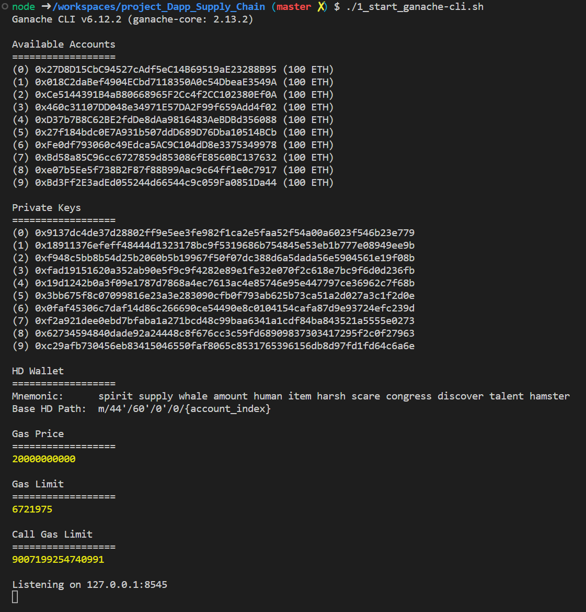
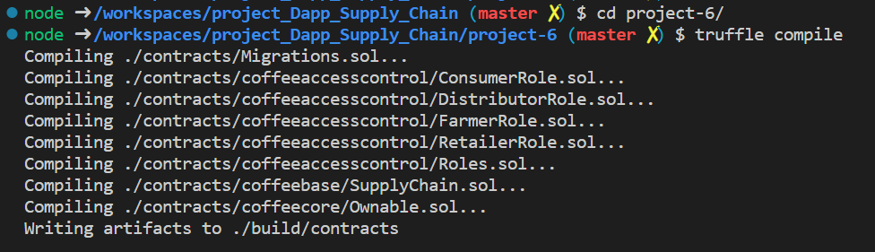
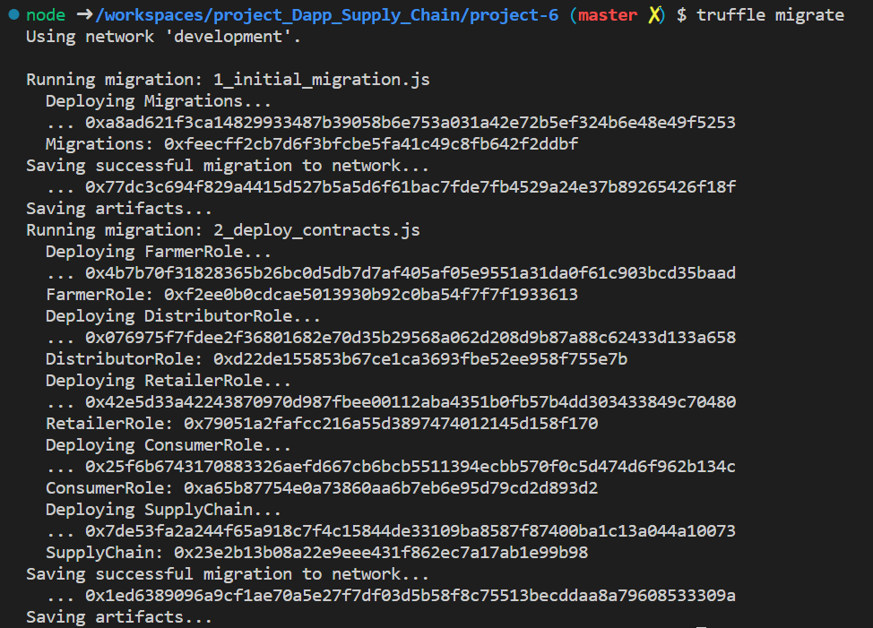
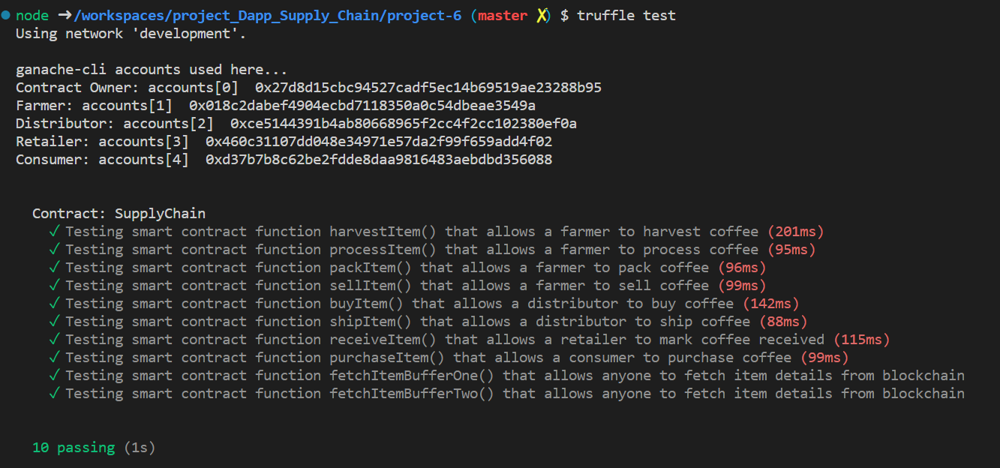
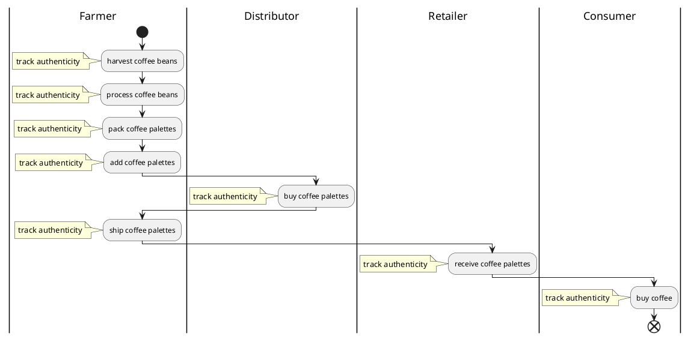
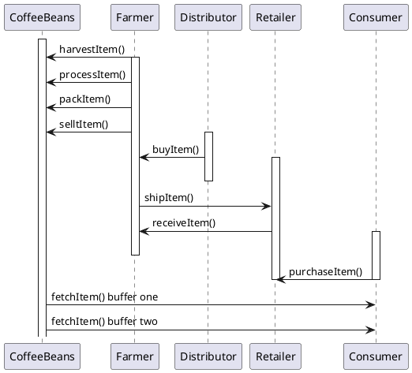
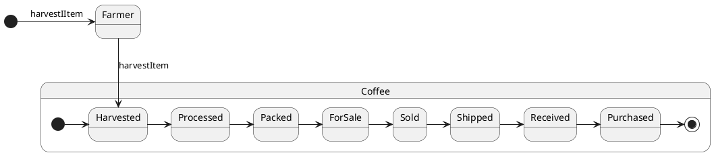
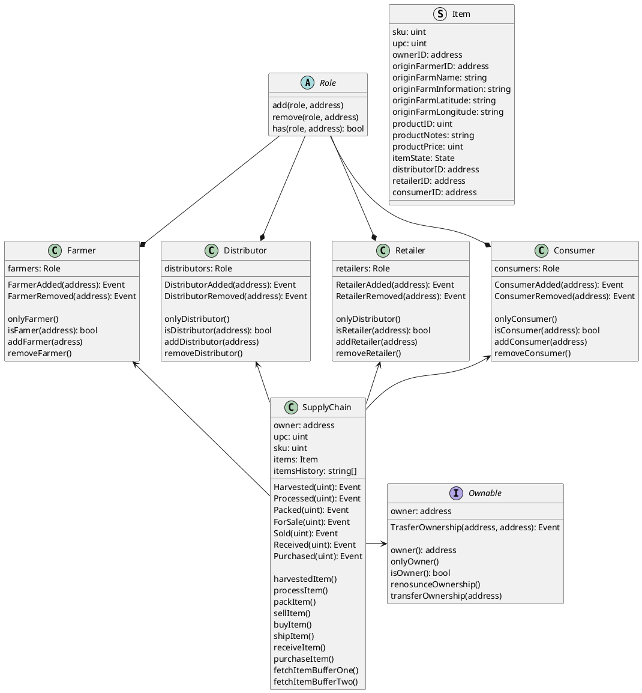

# Supply Chain Dapp - Udacity Blockchain Nanodegree Project
This repo contains the solution to the Supply Chain Dapp project deployed to the Ethereum platform.  The project starter code used is from [here](https://github.com/udacity/nd1309-Project-6b-Example-Template).

- [Supply Chain Dapp - Udacity Blockchain Nanodegree Project](#supply-chain-dapp---udacity-blockchain-nanodegree-project)
  - [Overview](#overview)
  - [Getting Started](#getting-started)
    - [Prerquisites](#prerquisites)
    - [Installing](#installing)
  - [UML Diagrams](#uml-diagrams)
    - [Activity Diagram](#activity-diagram)
    - [Sequence Diagram](#sequence-diagram)
    - [State Diagram](#state-diagram)
    - [Class Diagram](#class-diagram)
  - [Supply chain \& data auditing](#supply-chain--data-auditing)
  - [6. Built With](#6-built-with)
  - [7. Authors](#7-authors)
  - [8. Acknowledgments](#8-acknowledgments)
  
## Overview
The supply chain modeled in this project is for the process of harvesting coffee beans thru delivery to the end consumer.  More details are described in the sections below.

The completed and deployed app information:
| Key | Value |
|---|---|
| Goerli Network Contract Address | 0xd401AF0e681B846D20fa71003d68Cc589d1216B9 [link](https://goerli.etherscan.io/address/0xd401AF0e681B846D20fa71003d68Cc589d1216B9)|
| Truffle | v4.1.14 (core: 4.1.14) |
| Ganache CLI | v6.12.2 (ganache-core: 2.13.2) |
| Solidity | v0.4.24 (solc-js) |
| Node | v16.19.0 |

## Getting Started
Instructions in this section will get a copy of this project set up and running on a local machine for development and testing.

### Prerquisites
You will need to install node.js with npm and install metamask in your browser.

### Installing
Clone this repository to a local folder:
```
git clone https://github.com/StuKozola/Udacity-Supply-Chain-Dapp
```
This code was developed and tested with Truffle v4.1.14 and Solidity v0.4.24. Install Truffle with Solidity:
```
npm i -g truffle@4.1.14
```
Install Ganache globally:
```
npm install ganache --global
```

Change the directory to `project-6` and install all required npm packages listed in package.json:
```
cd project-6
npm install
```
Launch Ganache:
```
ganache-cli -m "spirit supply whale amount human item harsh scare congress discover talent hamster"
```
or use the shell script
```
./1_start_ganache-cli.sh
```
Your terminal should look something like this:



In a separate terminal window, Compile smart contracts:

```
cd project-6
truffle compile
```

Your terminal should look something like this:



This will create the smart contract artifacts in folder ```build\contracts```.

Migrate smart contracts to the locally running blockchain, ganache-cli:

```
truffle migrate
```

Your terminal should look something like this:



Test smart contracts:

```
truffle test
```

All 10 tests should pass.



To deploy the contracts to the Goelib Public Network using Infura, create a `.env` file with the following:
```
INFURA_KEY=<YOUR INFURA PROJECT KEY FOR GOERLI>
MNEMONIC=<YOUR MNEMONIC FROM INFURA>
```
Then deploy with Truffle:
```
truffle migrate --reset --network goerli
```

In a separate terminal window, launch the DApp:

```
cd project-6
npm run dev
```
## UML Diagrams
The design of this project is captured in the following diagrams.
###  Activity Diagram
4 actors in a coffee supply chain are:
* Farmer: The Farmer can harvest coffee beans, process coffee beans, pack coffee palettes, add coffee palettes, ship coffee palettes, and track authenticity.
* Distributor: The Distributor can buy coffee palettes and track authenticity.
* Retailer: The Retailer can receive coffee palettes and track authenticity.
* Consumer: The consumer can buy coffee palettes and track authenticity.



###  Sequence Diagram
The overall delivery of coffee beans to the end consumer is as follows:
* The farmer
  * harvests the coffee beans
  * processes the coffee beans
  * packs the coffee beans into palettes
  * lists the palettes for sale
* The distibutor
  * can buy a palette for sale from a farmer to have delievered to a retailer
  * if the distributor pays the right price, the farmer will ship the item to the reailer
* The retailer
  * will let the farmer know the coffee bean palette has been recieved
* The consumer
  * can purchase coffee beans from the retailer once the shipment from the farmer has been received
* All participants can track the state of the supply chain through data stored on the blockchain


### State Diagram
The state of the coffee beans through the supply chain go from:
* Harvested by the farmer
* Processeed by the farmer
* Packed by the farmer
* ForSale by the famer
* Sold to a distributor
* Shipped to a retailer
* Received by a retailer
* Purchased by a consumer
  


### Class Diagram
The overall design of the contracts are captured in the class diagram below.




## Supply chain & data auditing

This repository containts an Ethereum DApp that demonstrates a Supply Chain flow between a Seller and Buyer. The user story is similar to any commonly used supply chain process. A Seller can add items to the inventory system stored in the blockchain. A Buyer can purchase such items from the inventory system. Additionally a Seller can mark an item as Shipped, and similarly a Buyer can mark an item as Received.

The DApp User Interface when running should look like...


##  6. <a name='BuiltWith'></a>Built With

* [Ethereum](https://www.ethereum.org/) - Ethereum is a decentralized platform that runs smart contracts
* [IPFS](https://ipfs.io/) - IPFS is the Distributed Web | A peer-to-peer hypermedia protocol
to make the web faster, safer, and more open.
* [Truffle Framework](http://truffleframework.com/) - Truffle is the most popular development framework for Ethereum with a mission to make your life a whole lot easier.


##  7. <a name='Authors'></a>Authors

See also the list of [contributors](https://github.com/your/project/contributors.md) who participated in this project.

##  8. <a name='Acknowledgments'></a>Acknowledgments

* Solidity
* Ganache-cli
* Truffle
* IPFS